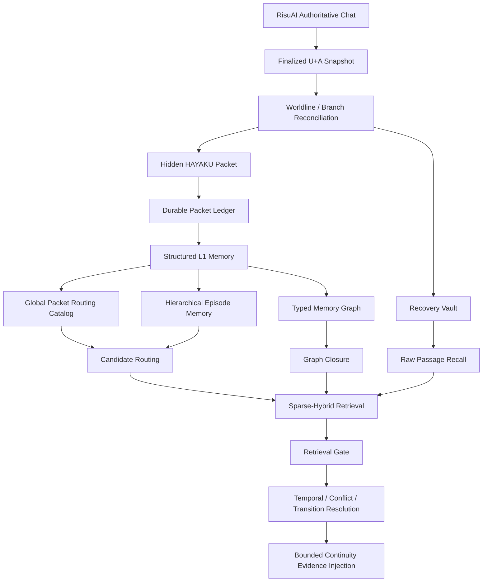

# HAYAKU · Locator Continuity

> **Branch-aware, embedding-free long-term memory for long-horizon RisuAI role-play.**  
> Structured packet memory, sparse-hybrid retrieval, temporal worldlines, typed memory graphs, hierarchical episodes, and fail-soft recovery — without a vector database or direct LLM call from HAYAKU itself.


---

## Overview

**HAYAKU · Locator Continuity** is a long-term continuity and memory plugin for RisuAI.

HAYAKU does not treat memory as a single prose summary or a vector-search database. Instead, it combines:

- structured state packets
- a durable packet ledger
- branch-aware worldline/version tracking
- sparse-hybrid information retrieval
- typed memory graphs
- hierarchical episodic routing
- temporal/current-state reasoning
- exact-text recovery fallback
- source-preserving session handoff

The visible RisuAI conversation remains the authoritative history. HAYAKU's packet, ledger, graph, episode index, and recovery data are **sidecars derived from or bound to that history**.

HAYAKU itself makes **no direct generative LLM/API call** and uses **no embedding provider or vector DB**. The main response model writes a hidden HAYAKU packet as part of the normal response, and HAYAKU validates, stores, indexes, retrieves, and injects continuity evidence around that packet.

---

## Table of Contents

- [Core Philosophy](#core-philosophy)
- [Architecture](#architecture)
- [Memory Model](#memory-model)
- [Retrieval Engine](#retrieval-engine)
- [Typed Memory Graph](#typed-memory-graph)
- [Hierarchical Episodic Memory](#hierarchical-episodic-memory)
- [Temporal Memory and Current-State Reasoning](#temporal-memory-and-current-state-reasoning)
- [Worldline, Reroll, and Rollback](#worldline-reroll-and-rollback)
- [Recovery Architecture](#recovery-architecture)
- [Storage and Handoff](#storage-and-handoff)
- [Prompt Caching](#prompt-caching)
- [Reliability and Integrity](#reliability-and-integrity)
- [Academic / Technical Classification](#academic--technical-classification)
- [Configuration](#configuration)
- [What HAYAKU Does Not Do](#what-hayaku-does-not-do)
- [Version](#version)

---

# Core Philosophy

HAYAKU is built around several invariants.

### 1. The visible chat is authoritative

The real RisuAI `U + A` chain owns turn topology.

A packet may describe a turn, but it may **not create, reactivate, or choose a chat branch** by itself.

```text
Authoritative Chat
      │
      ▼
Worldline
      │
      ├── Packet Ledger
      ├── Recovery Vault
      ├── Structured Memory
      ├── Typed Graph
      └── Episode Index
```

### 2. Memory is evidence, not free-floating prose

HAYAKU separates:

- what actually happened
- current state
- historical state
- unresolved commitments
- relationships
- secrets and POV knowledge
- world rules
- narrative changes
- planner continuity locks

This reduces the chance that old or superseded facts are treated as current truth.

### 3. Retrieval must degrade gracefully

If structured packet memory fails, HAYAKU can still preserve and retrieve exact visible `U+A` text through the Recovery Vault.

```text
Rich packet available
    → structured recall

Rich packet missing
    → Recovery Vault
    → verbatim raw recall
```

### 4. Long sessions must remain bounded

Search indexes and caches are request/session-local and rebuildable. Expensive graph, episode, and retrieval work is bounded by candidate caps, deadlines, hop limits, and performance guards.

### 5. Branch safety is more important than aggressive recovery

A memory tied to an old reroll must never migrate onto the new reroll simply because both are `T53`.

Every repair and recovery operation is bound to the exact active worldline variant.

---

# Architecture



HAYAKU is therefore not a single retrieval algorithm. It is a layered memory system:

```text
Evidence
→ Representation
→ Routing
→ Retrieval
→ Consistency Resolution
→ Bounded Injection
```

---

# Memory Model

## Structured Packet Schema

HAYAKU uses `hayaku_packet_v1` with `packet_schema_rev: 2`.

The six required top-level axes are:

```text
meta
entity
world
narrative
planner
importance
```

Major canonical collections include:

### `meta`
- summary memory
- speaker boundaries
- overpromotion risks
- consent memory
- lineage / turn metadata

### `entity`
- characters
- relations
- POV memories
- secrets

### `world`
- active events
- historical events
- world rules
- offscreen threads
- factions
- regions

### `narrative`
- conflict traces
- scene deltas
- theme motifs
- critical dialogue

### `planner`
- continuity locks
- do-not-resolve-yet items
- consequence ledger
- payoff tracker
- open invitations

The packet is not an unrestricted JSON blob. HAYAKU normalizes and validates packet structure before treating it as authoritative structured memory.

---

## Natural Memory Notes

HAYAKU also derives packet-level natural memory notes from structured data.

These notes can include:

- core memory
- durable changes
- continuity locks
- unresolved matters
- character/relationship state
- knowledge boundaries
- critical dialogue
- unsupported/false inference warnings
- recall anchors
- aliases
- canonical anchors

The natural note is a retrieval aid, not a replacement for the structured packet.

---

# Retrieval Engine

HAYAKU uses an **embedding-free sparse-hybrid retrieval stack**.

## BM25F

The core sparse scorer uses field-weighted BM25F.

Current field weights:

| Field | Weight |
|---|---:|
| canonical | 4.0 |
| identity | 3.4 |
| relation | 2.8 |
| state | 2.2 |
| event | 1.9 |
| context | 1.35 |
| temporal | 1.2 |
| summary | 0.65 |

This allows a canonical identity or relationship match to matter more than a generic summary-word overlap.

---

## Lexical and Fuzzy Channels

HAYAKU combines multiple independent evidence channels:

- exact matching
- phrase matching
- BM25/BM25F
- weighted lexical coverage
- strengthened Jaccard similarity
- character n-grams
- entity identity matching
- canonical-anchor matching
- semantic-frame tokens
- location/object signals
- recent-context support

Character n-grams make retrieval more tolerant of spelling, morphology, and partial lexical overlap without using embeddings.

---

## Reciprocal Rank Fusion

Independent sparse channels are merged with **Reciprocal Rank Fusion (RRF)**.

```text
BM25F
Identity
Canonical Exact
Association
Character n-gram
Lexical Coverage
Phrase
      │
      ▼
     RRF
      │
      ▼
Unified Candidate Ranking
```

This reduces reliance on any single retrieval signal.

---

## Multi-query Recall

Long or compound inputs can be deterministically decomposed into several retrieval topics.

The original query remains authoritative, while subtopics improve coverage for multi-topic prompts.

This is deterministic query decomposition rather than an extra LLM query-rewrite call.

---

## Adaptive Recent Context

Recent messages are treated as a **separate context focus**, not as a replacement for the current user input.

HAYAKU can reduce or disable recent-context support when it detects:

- a topic shift
- a new scene boundary
- sufficiently explicit current input

This prevents a short but clear current instruction from being overwhelmed by vocabulary copied from the previous scene.

---

## Retrieval Gate

Candidate generation and final admission are separate stages.

A memory can have a non-zero score and still fail the retrieval gate if there is insufficient direct evidence, relevance, temporal support, or continuity justification.

This is intentionally precision-oriented.

---

## Multi-resolution Recall

HAYAKU can search different horizons and resolutions rather than treating every memory as equally local.

Broad historical/timeline queries can activate older routing layers, while current-state queries penalize stale or superseded memories.

---

# Typed Memory Graph

HAYAKU builds a request-local typed graph over structured memory rows.

Supported semantic relations include:

```text
SUPERSEDES
SUPERSEDED_BY
CONTRADICTS
RESOLVES
RESOLVED_BY
FULFILLS
FULFILLED_BY
VIOLATES
VIOLATED_BY
CAUSES
CAUSED_BY
RESULT_OF
DEPENDS_ON
PREREQUISITE_OF
CONTINUES
```

Associative relations are also used, including:

```text
same_packet
related_ref
same_canonical
same_entity
same_place
same_object
same_scene
```

## Graph Closure

After the normal retrieval gate, HAYAKU can traverse a small number of strongly related graph neighbors.

This is bounded by:

- seed count
- hop count
- edge weight
- target evidence
- bundle size
- total graph-node budget

The goal is to recover a relevant **change chain**, not to flood the prompt with every graph neighbor.

Example:

```text
Promise
   │ FULFILLED_BY
   ▼
Event
   │ CAUSES
   ▼
Consequence
```

A query matching the event may therefore recover the promise and consequence when the graph evidence is strong enough.

---

# Hierarchical Episodic Memory

HAYAKU groups atomic memory rows into scene/turn episodes and recursively groups those episodes into parent episodes.

```text
L1 Atomic Memory
      │
      ▼
Leaf Episode
      │
      ▼
Parent Episode
      │
      ▼
Higher-level Routing
```

The episode hierarchy is a **router**, not a new factual authority.

A successful high-level match descends back to the exact leaf and then to the original L1 memory rows.

```text
Parent Episode Match
→ Relevant Child Episode
→ Leaf Episode
→ Exact L1 Memory
```

This provides a hierarchical long-range index while keeping the final injected evidence grounded in the underlying structured memory.

---

# Global Packet Routing Catalog

For very long chats, HAYAKU uses a coarse-to-fine routing layer before expensive packet ingestion.

The global catalog uses cheap features such as:

- turn range
- scene ID
- mentioned entities
- places
- objects
- canonical anchors
- summary fragments
- event cues
- importance

Broad queries such as:

- "전체 흐름"
- "처음부터 지금까지"
- "예전 에피소드"
- "timeline"
- "history"

can first locate relevant old packet regions and then route them into the full retrieval pipeline.

This prevents old but relevant memory from becoming unreachable simply because it was not included in the initial bounded ingest set.

---

# Temporal Memory and Current-State Reasoning

## Validity-aware Temporal Decay

Different memory classes decay at different rates.

Representative half-life profiles:

| Memory class | Half-life |
|---|---:|
| protected | ∞ |
| canonical | 180 turns |
| open commitment | 120 |
| knowledge | 96 |
| durable event | 72 |
| episodic | 42 |
| relation state | 28 |
| transient state | 10 |
| superseded | 4 |

Decay is a **retrieval prior**, not deletion.

Important canonical rules, unresolved locks, and knowledge boundaries can remain strongly recallable even when old.

---

## Current-State Projection

Repeated snapshots are projected into a current-state view.

HAYAKU distinguishes between:

- durable state
- scene-bound state
- transient action/posture/expression

Examples:

```text
durable:
  carrying an item
  persistent attire
  physical condition

scene-bound:
  location
  local emotional/status state

transient:
  a single gesture
  one-off posture
  instantaneous action
```

Historical snapshots remain stored, but ordinary current-state recall prefers the latest valid projection.

---

## Contradiction and Transition Handling

HAYAKU distinguishes historical change from current truth.

A pipeline can include:

```text
Candidate Retrieval
→ RRF
→ Packet Cohesion
→ Transition Bundle
→ Conflict Collapse
→ Multi-topic Coverage
→ Final Selection
```

This helps prevent:

```text
"The key is in the drawer"
```

and

```text
"The key was later moved into the pocket"
```

from being treated as equally current facts.

---

# Worldline, Reroll, and Rollback

HAYAKU models the live conversation as a branch-aware version graph.

## Logical Turn Identity

Conceptually:

```text
logicalTurnId =
hash(
  scope,
  parentTurnNodeId,
  userHash,
  pairIndex
)
```

## Response Variant Identity

```text
variantId =
hash(
  logicalTurnId,
  assistantVisibleHash or assistantMessageIdHash
)
```

Therefore a reroll is not "editing the same memory in place."

It is a new response variant of the same logical turn.

---

## Reroll

```text
T53 / A-old
    ↓ reroll
T53 / A-new
```

The old variant becomes superseded and the new variant becomes active.

Packets and Recovery Vault debt follow the exact variant.

A packet or repair generated for `A-old` may never be attached to `A-new`.

---

## Rollback

Rollback uses a conservative two-observation retirement policy.

```text
First stable absence
→ quarantined

Second independent stable absence
→ orphaned / retired branch state
```

This prevents a transient or incomplete host snapshot from immediately destroying valid branch state.

The turn topology is rebuilt from the authoritative chat and is not tail-capped merely because the session is long.

---

## Worldline State Mapping

Typical lifecycle states include:

```text
active
quarantined
superseded
inactive_variant
detached_branch
retired
orphaned
```

Durable memory records mirror the state of their worldline owner.

---

# Recovery Architecture

HAYAKU has multiple recovery layers.

## 1. Recovery Vault

If a finalized active-worldline `U+A` has no usable packet, HAYAKU stores the exact visible text in:

```text
hayaku.v2.recovery_vault.<scopeKey>
```

The Recovery Vault is not a second chat database. It is a durable failure/evidence journal for packet debt.

Current v2.4.28 debt identity is branch-aware and can include:

```text
debtId
ownerTurnNodeId
logicalTurnId
variantId
parentTurnNodeId
pairIndex
userHash
userMessageIdHash
assistantVisibleHash
assistantMessageIdHash
worldlineRevision
sourceEvidenceHash
```

A matching pair index alone is not enough to identify the same debt.

---

## 2. Raw Passage Recall

When structured memory is unavailable, HAYAKU can retrieve relevant exact-text passages from the Recovery Vault using:

- exact phrase
- BM25
- rare-term weighting
- proximity
- character n-gram similarity
- RRF

The final evidence is offset-sliced from the original stored text.

This allows memory to degrade from structured recall to verbatim evidence instead of disappearing completely.

---

## 3. HAYAKU In-band Recovery

HAYAKU can ask the normal response model to emit:

```text
recovery_snapshot
current_snapshot
```

in the same response when a prior packet debt must be repaired.

The recovery packet is bound to the original missing turn, while the current packet belongs to the current response.

---

## 4. Optional RE:TRACE Automatic Repair

HAYAKU v2.4.28 can cooperate with RE:TRACE as an **optional external repair worker**.

RE:TRACE is not required for normal HAYAKU operation.

When automatic repair is enabled in a compatible RE:TRACE build:

```text
Durable Recovery Debt
        │
        ▼
HAYAKU Owner Gate
        │
        ▼
Debt Lease
        │
        ▼
RE:TRACE Repair LLM
        │
        ▼
recovery_snapshot candidate
        │
        ▼
HAYAKU exact-worldline revalidation
        │
        ▼
Canonical adoption
        │
        ▼
Durable readback
        │
        ▼
Debt discharge
```

### Lease-based conflict prevention

HAYAKU in-band recovery and RE:TRACE automatic repair share a debt lease.

Only one worker may own a branch-bound debt at a time.

```text
owner = hayaku_inband
or
owner = retrace_auto
```

The first verified exact-target repair resolves the debt. Late duplicate or stale results are rejected.

---

## Recovery Lifecycle

| Worldline owner | Recovery debt | Raw recall | Automatic repair |
|---|---|---:|---:|
| active | deterministic fallback / repair pending | yes | yes |
| quarantined | suspended | no | suspended |
| superseded | superseded | no | cancelled |
| orphaned | orphaned | no | cancelled |
| detached branch | detached | no | cancelled |
| verified packet exists | discharged | no | finished |
| predecessor history | inherited history | historical only | no |

Recovery never creates a new story turn.

It repairs or preserves evidence for an existing exact worldline variant.

---

# Storage and Handoff

## Dual Ledger Model

HAYAKU uses a chat-first dual ledger.

```text
Live Chat Packet
      +
Durable Storage Ledger
```

Rules:

- valid packets in the active chat are authoritative
- storage fills missing durable packet slots
- storage cannot create a chat branch
- packet-body absence alone is not treated as deletion
- intentional forgetting uses tombstones

---

## Memory Suite Storage Modes

Per-scope storage can use:

### `plugin_only`
RisuAI `pluginStorage`

### `mirror`
`pluginStorage` + Memory Suite server

### `server_only`
Memory Suite server

The server stores HAYAKU-owned opaque values; HAYAKU remains the owner of its data schema and semantics.

---

## Immutable Shared Archives

Older session memory can be moved behind immutable shared archive references.

Cold archive bodies can be gzip-compressed and hydrated lazily.

This reduces active storage pressure while preserving historical memory.

---

## Source-Immutable Handoff

RE:TRACE session handoff follows a source-preserving contract.

The source session must not be:

- deleted
- emptied
- compacted
- rewritten into an archive-only form
- mutated merely to create the next session

HAYAKU verifies source fingerprints before and after transfer/adoption.

The destination receives references/copies required for continuity while the original source remains intact.

---

# Prompt Caching

HAYAKU supports:

```text
off
structural
native
```

The default mode is `structural`.

Native mode can use RisuAI's body interception path to cooperate with provider-native prompt caching where supported.

Prompt caching is an optimization layer and does not change packet authority, worldline identity, or stored memory semantics.

---

# Reliability and Integrity

## Finalized-chat monitoring

Packet capture does not rely only on one transient hook payload.

HAYAKU can observe:

- streaming output
- `afterRequest`
- finalized stored chat

A finalized response must stabilize before a truly missing/unusable packet becomes durable Recovery Vault debt.

This reduces false recovery caused by partially streamed packets.

---

## Content-based identity

HAYAKU uses stable hashes for:

- logical turns
- response variants
- packet identities
- snapshot identity
- storage fingerprints
- recovery evidence

This provides content-linked provenance rather than relying only on physical message position.

---

## Reconciliation

The durable ledger is continuously reconciled against the authoritative chat snapshot.

```text
Authoritative Chat
→ Worldline Reconstruction
→ Ledger Binding
→ Slot Reconciliation
→ Recall
```

This prevents stale storage from silently reactivating an old branch.

---

## Tombstones

Intentional deletion/forgetting uses recoverable tombstones.

This prevents a hidden or stale mirror from resurrecting data that was deliberately retired.

---

## Durable readback

Important writes are not considered complete merely because a write API returned success.

HAYAKU uses readback/digest verification for durable state where required.

---

## Fail-open vs Fail-closed

HAYAKU deliberately uses different failure semantics for different operations.

### Fail-open
Normal generation/recall path:
- storage stall should not freeze the conversation
- bounded host calls
- optional recall can degrade

### Fail-closed
Integrity-sensitive operations:
- unsafe branch binding
- incompatible handoff
- source mutation
- invalid repair target
- failed durable verification

This keeps chat usable without sacrificing memory integrity.

---

# Academic / Technical Classification

HAYAKU combines methods from several research and engineering domains.

| Domain | HAYAKU technique | Academic / engineering analogue |
|---|---|---|
| Information Retrieval | BM25F | field-weighted probabilistic IR |
| Information Retrieval | Jaccard / weighted overlap | set similarity |
| Information Retrieval | character n-grams | fuzzy lexical retrieval |
| Information Retrieval | phrase / proximity | positional retrieval |
| Information Retrieval | RRF | rank fusion / ensemble retrieval |
| Query Processing | multi-query recall | query decomposition |
| Retrieval | adaptive context | context-aware retrieval |
| Retrieval | retrieval gate | precision-oriented candidate filtering |
| Retrieval | multi-resolution lanes | hierarchical / horizon-aware retrieval |
| Routing | Global Packet Catalog | coarse-to-fine candidate generation |
| Memory | structured packet memory | schema-based knowledge representation |
| Memory | hierarchical episodes | episodic memory / hierarchical index |
| Knowledge Representation | typed memory graph | domain-specific knowledge graph |
| Graph Retrieval | graph closure | bounded associative traversal |
| Temporal Reasoning | validity decay | time-aware ranking |
| Temporal Reasoning | current-state projection | temporal DB current-view projection |
| Consistency | contradiction collapse | contradiction-aware retrieval |
| Epistemics | POV / secret boundaries | epistemic access-control model |
| Multilingual IR | canonical multilingual anchors | dictionary-based CLIR |
| Versioning | worldline | revision graph / MVCC-like model |
| Versioning | reroll variants | branch-aware multi-version state |
| Failure Detection | two-observation rollback | hysteresis / debouncing |
| Provenance | hashes + source metadata | data lineage / provenance tracking |
| Deletion | tombstones | logical deletion |
| Recovery | Recovery Vault | durable recovery journal |
| Concurrency | debt lease | lease-based mutual exclusion |
| IPC | plugin channels | message-passing architecture |
| Reliability | durable readback | read-after-write verification |
| Handoff | immutable source transfer | immutable snapshot/reference transfer |
| Storage | plugin/mirror/server | tiered / replicated storage |
| Performance | bounded graph/index work | resource-bounded computation |
| Serving | prompt caching | prefix/cache optimization |
| Archive | gzip + lazy hydration | compressed cold-tier storage |

A concise academic description is:

> **HAYAKU is a branch-aware, sparse-hybrid hierarchical memory architecture for long-horizon LLM role-playing agents, combining structured episodic memory, temporal knowledge graphs, provenance-aware versioning, and fault-tolerant recovery without requiring embeddings or a vector database.**

---

# Configuration

Below are the major user-facing plugin arguments in v2.4.28.

## Core

| Argument | Default | Description |
|---|---:|---|
| `hayaku_enabled` | `true` | Enable HAYAKU |
| `hayaku_mode` | `auto` | `auto / balanced / fast / deep` |
| `hayaku_prompt_mode` | `auto` | Packet/continuity prompt profile |
| `hayaku_prompt_cache` | `structural` | `off / structural / native` |
| `hayaku_max_items_per_axis` | `3` | Max selected items per structured axis |
| `hayaku_memory_language` | `ko` | Memory language preference |
| `hayaku_debug` | `false` | Debug diagnostics |

## Sparse Retrieval

| Argument | Default | Description |
|---|---:|---|
| `hayaku_bm25_channel` | `true` | Enable BM25/BM25F sparse channel |
| `hayaku_bm25_weight` | `0.08` | BM25 contribution |
| `hayaku_recall_relatedness_weight` | `70` | Relevance preference |
| `hayaku_recall_recency_weight` | `30` | Story-turn recency preference |
| `hayaku_recall_context_messages` | `5` | Recent messages used as separate context focus |
| `hayaku_adaptive_context_window` | `true` | Adaptive recent-context size |
| `hayaku_multi_query_recall` | `true` | Deterministic query decomposition |
| `hayaku_contradiction_bundle` | `true` | Contradiction/transition retrieval |
| `hayaku_multi_resolution_recall` | `true` | Multiple temporal retrieval horizons |
| `hayaku_recall_stability` | `true` | Request-local recall stability |
| `hayaku_recall_stability_boost` | `0.025` | Stability boost |

## Recovery

| Argument | Default | Description |
|---|---:|---|
| `hayaku_packet_recovery` | `true` | Detect and repair packet debt |
| `hayaku_packet_coverage_audit` | `true` | Audit packet coverage |
| `hayaku_packet_coverage_fallback_recall` | `true` | Fallback recall for safe missing packet coverage |
| `hayaku_recovery_vault` | `true` | Preserve exact U+A for unusable/missing packets |
| `hayaku_raw_passage_recall` | `true` | Search Recovery Vault as verbatim evidence |
| `hayaku_raw_recall_max_items` | `3` | Max raw passages per request |
| `hayaku_raw_recall_max_chars` | `2400` | Raw evidence character budget |
| `hayaku_raw_recall_min_score` | `0.16` | Minimum raw recall score |

## Graph / Episode Routing

| Argument | Default | Description |
|---|---:|---|
| `hayaku_typed_memory_graph` | `true` | Build typed memory relations |
| `hayaku_graph_closure_recall` | `true` | Allow bounded typed-neighbor recall |
| `hayaku_graph_closure_max_nodes` | `8` | Max graph closure rows |
| `hayaku_hierarchical_episode_memory` | `true` | Build hierarchical episode router |
| `hayaku_episode_router_max_hits` | `3` | Max routed episode hits |

---

# Capacity Guardrails

Representative durable limits in v2.4.28 include:

```text
Packet ledger records        1024
Packet ledger slot heads     4096
Packet ledger tombstones     1024
Max packet chars             96,000
Ledger total packet chars    16,000,000

Recovery Vault records       1024
Recovery Vault total chars   12,000,000
Recovery Vault turn chars    240,000
```

These are storage/retention guardrails, not a statement that every request hydrates all data into memory.

HAYAKU uses bounded indexing, archive hydration, routing, and caching to avoid treating the full durable history as one monolithic prompt-time corpus.

---

# What HAYAKU Does Not Do

HAYAKU is intentionally narrow.

It is **not** a response-writing enhancer.

HAYAKU does not own:

- prose style
- scene direction
- dialogue rewriting
- POV writing style
- repetition control
- generic response improvement

It also does not require:

- embeddings
- a vector DB
- a separate generative LLM call per turn

Its job is continuity memory:

```text
collect
→ validate
→ bind
→ store
→ retrieve
→ reconcile
→ inject factual continuity
→ request the next packet
```

---

# Design Summary

The complete HAYAKU memory stack can be summarized as:

```text
┌──────────────────────────────────────────────┐
│  RisuAI Authoritative U+A Conversation      │
└──────────────────┬───────────────────────────┘
                   │
            Worldline / Versioning
                   │
        ┌──────────┴──────────┐
        │                     │
 Structured Packet       Recovery Vault
        │                     │
 Packet Ledger          Exact Raw Evidence
        │                     │
        ├──── L1 Memory ──────┤
        │
        ├─ Global Routing Catalog
        ├─ Hierarchical Episodes
        ├─ Typed Memory Graph
        │
        ▼
 Sparse-Hybrid Retrieval
 BM25F · Jaccard · n-gram · exact · phrase
 canonical · entity · relation · RRF
        │
        ▼
 Retrieval Gate
        │
        ▼
 Temporal / Conflict / Transition Resolution
        │
        ▼
 Bounded Continuity Evidence
        │
        ▼
 Main Response Model
```

---

# Version

Current README target:

```text
HAYAKU · Locator Continuity
Version: 2.4.28
RisuAI API: 3.0
Packet schema: hayaku_packet_v1 / rev 2
Worldline: hayaku_turn_worldline_v2
Storage ledger: hayaku_storage_ledger_v2
Recovery Vault: hayaku.recovery_vault.v1 / internal version 2
```

Repository plugin ID:

```text
hayaku_locator_continuity
```

---

## Project Positioning

HAYAKU is best understood not as "vector RAG without vectors," but as a memory system built from a different family of ideas:

- classical information retrieval
- temporal databases
- knowledge graphs
- version control
- provenance tracking
- event-driven recovery
- fault-tolerant storage

Its central design principle is simple:

> **The model may generate memory, but the memory system decides what is valid, current, branch-correct, recoverable, and safe to recall.**
